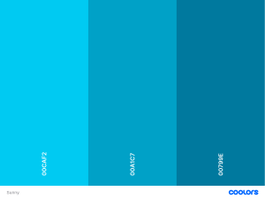
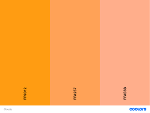
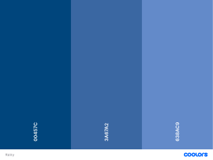

# Weather Way - Milestone Project 2

## HTML/CSS/JS ESSENTIALS - Interactive Frontend Website

Weather Way flips the script on traditional activity planning by placing the weather at the heart of your decision-making process. Here's how it works: you start by checking the weather for your desired location and date. With this information in hand, our platform then invites you to explore a diverse array of activities that perfectly align with the forecast. Whether you're keen on enjoying live music under the stars on a clear night, cozying up in a charming coffee shop during a drizzle, or wandering through the quiet halls of a museum on a rainy afternoon, Weather Way makes it effortless. Our unique approach ensures that the weather guides you towards making the best out of your day, turning what could have been a deterrent into an opportunity to discover the perfect activities for any condition.

Click [Here](https://ty-thetravelguy.github.io/weather-today-mp2/) to view the webpage.

## Business Needs

1. Attract and Retain Users: Establish a platform that becomes the go-to resource for weather-related planning, thereby increasing user engagement and loyalty.
2. Brand Recognition and Trust: Build a reputable brand that is synonymous with reliability and innovation in weather-dependent planning, encouraging word-of-mouth promotion and user growth.
3. User Feedback and Improvement: Implement mechanisms for user feedback to continuously improve the platform, ensuring it meets evolving user needs and stays ahead of competition.

### Future Development Business Wants

1. Data Collection and Analysis: Gather data on user preferences and behaviour to refine and personalize the service offering, enhancing user satisfaction and the platform's value proposition.
2. Monetisation Strategies: Develop revenue models through advertising, partnerships with local businesses (like cafes, museums, and music venues), and premium subscription options offering additional features.

## User Needs

1. Accurate, Real-time Weather Forecasts: Access to reliable and precise weather information that helps them make informed decisions about planning activities.
2. Variety of Activities: The ability to search for a variety of activities that cater to different interests, weather conditions, and times of the day, ensuring there's always something to do.
3. Ease of Use: A user-friendly interface that makes it simple to navigate between weather forecasts and activity suggestions, providing a seamless planning experience.

### Future Development User Wants

1. Personalization: The ability to receive recommendations based on personal preferences, previous searches, and location, making the planning process quicker and more relevant.
2. Social Sharing and Collaboration: Features that enable users to share plans and activity suggestions with friends and family, facilitating social outings and collaborative planning.

## Design Process

In designing the weather app, the primary goal was to create an interface that was not only functional but also visually engaging and intuitive for users. The decision to use specific color palettes for both the website and the weather cards was driven by the desire to enhance user experience and convey information through color effectively.

The website itself employs a sophisticated and modern color scheme with shades of dark blue (#0C1330), muted purple (#474554), soft lavender (#ACA7CB), and light grey (#E0E0E0). This palette was chosen to create a calming and professional backdrop that allows the vibrant weather cards to stand out, ensuring users can quickly gauge the weather outlook without being overwhelmed by the interface's base colors.

For the weather cards, the use of gradients serves a dual purpose: aesthetically pleasing transitions and a visual representation of weather conditions. The gradients ranging from sunny, cloudy, snowy, rainy, foggy, to stormy weather conditions utilize specific color schemes to evoke the essence of each weather type, making the app not just visually appealing but also highly informative at a glance.

The integration of the Google Places API with autocomplete functionality significantly enhances the user experience by ensuring the accuracy of city entries. This feature, coupled with the app's ability to fetch international weather data from the OpenWeather API using latitude and longitude coordinates, allows for a globally comprehensive weather service. Users can search for activities based on the weather, making the app a versatile tool for daily planning.

Additionally, a "Contact Us" form was implemented, leveraging the EmailJS API, to allow users to send emails directly through the app. This feature fosters a direct line of communication between the user and the app developers, enhancing support and user engagement.

In summary, the design process of the weather app was deeply influenced by the desire to create a user-centric interface. The thoughtful selection of color schemes, the integration of essential APIs for accuracy and global weather data, and the inclusion of a contact mechanism, all contribute to a comprehensive and intuitive user experience. The app not only serves as a tool for checking the weather but also as a guide for planning activities, reflecting a seamless blend of aesthetic appeal and functionality.

### Colors

#### Website Colors

Colors - #0C1330, #474554, #ACA7CB, #E0E0E0

#### Weather Cards

Sunny - #00CAF2, #00A1C7, #00799E

Cloudy - #FF9C12, #FFA257, #FFAE8B

Snowy - #8ED2EB, #61A6BE, #337C92

Rainy - #00457C, #3A67A2, #638AC9

Foggy - #11AC8D, #61C38B, #99D98A

Stormy - #6E6590, #8A80AD, #A89DCB

### Wireframe

## Technology Used

I created my Wireframe using Balsamiq Wireframes, which was downloaded onto my computer.

HTML5 / CSS3 / JavaScript

[Bootstrap V5](https://getbootstrap.com/) for responsive design.

[W3Schools](https://my-learning.w3schools.com/) to look up syntax and when I was trying to figure out how to create some JavaScript.

[Google Fonts](https://fonts.google.com/) for my fonts.

[Font Awesome](https://fontawesome.com/) for my icons on my footer.

[My Color Space](https://mycolor.space/) to look for colors which worked together.

[Coolors](https://coolors.co/) to create my color palettes.

[iStockPhotos](https://www.istockphoto.com/) where I found and paid for the image.

[Google Console](https://developers.google.com/) to learn about their APIs, create my key and restict the key.

[Open Weather Map](https://openweathermap.org/) the API I used to get the weather data.

[Email JS](https://www.emailjs.com/) for the contact form to set up the emailing servcie.

[Favicon.io](https://favicon.io/) to create my Favicon.

[Techsini](https://techsini.com/multi-mockup/index.php) to create my mock up.

## Bugs

Encountering a spacing issue after the paragraph with the ID welcomeMessage, I initially toggled visibility using visibility = hidden/visible to hide and show the paragraph. I realized that the containing div wasn't disappearing, but I wasn't sure how to resolve this. After some research and consulting with ChatGPT, I learned to create a function that checks if the content is truthy after trimming, as an empty string is considered falsy. Following this advice, I switched from using visibility = hidden/visible to style.display = none for showing and hiding content.

While integrating the Google Places Autocomplete API, I initially struggled to get it working. After delving into the Google Console, I discovered I was using the incorrect script URL. Once corrected, I noticed the API returned more information than I needed; I only wanted city names, but it provided full addresses. Further investigation led me to specify the types object as cities to narrow down the results to my requirements.

I faced another challenge when displaying the Google Map. Despite assigning the map div an ID of map, my CSS incorrectly used the . prefix for classes instead of # for IDs, preventing the JavaScript code from finding the map ID. This frustrating oversight was eventually clarified through student tutoring and reminded me of the importance of using IDs for unique elements and classes for multiple elements that share the same styling or functionality.

Working with the Open Weather Map API presented a significant challenge, as I couldn't get it to function correctly. Though I believed my URL was accurate, it wasn't until I signed up for a student developer account and received a different URL that I began receiving data. This breakthrough was a relief.

Lastly, the presentation of weather data in my app was initially less polished than I preferred, with temperatures and precipitation levels displaying too many decimal places. Recalling the round() method from my notes and applying it greatly improved the data's appearance.

Throughout the development of my app, I relied heavily on console.log for debugging and experimentation. This process has dramatically improved my understanding of JavaScript. ChatGPT has been instrumental in guiding me through various challenges and enhancing my problem-solving skills.

Although not a bug, I initially wanted to have 3 buttoms, one which show the weather for today, then another for a 3 day forcast, and another for a 5 day forcast. I did manage to get this to work but decided to remove it because it didn't make sence to have these three options. Seeing the weather for 5 days gives you everything you need.
