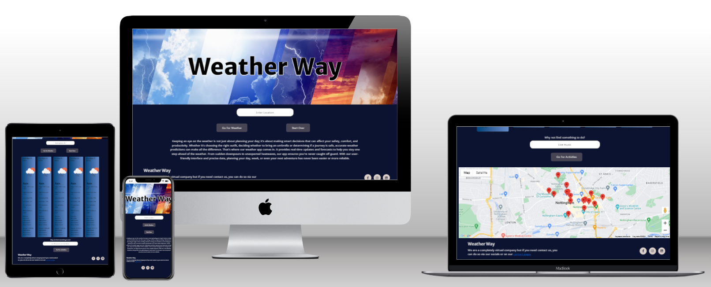
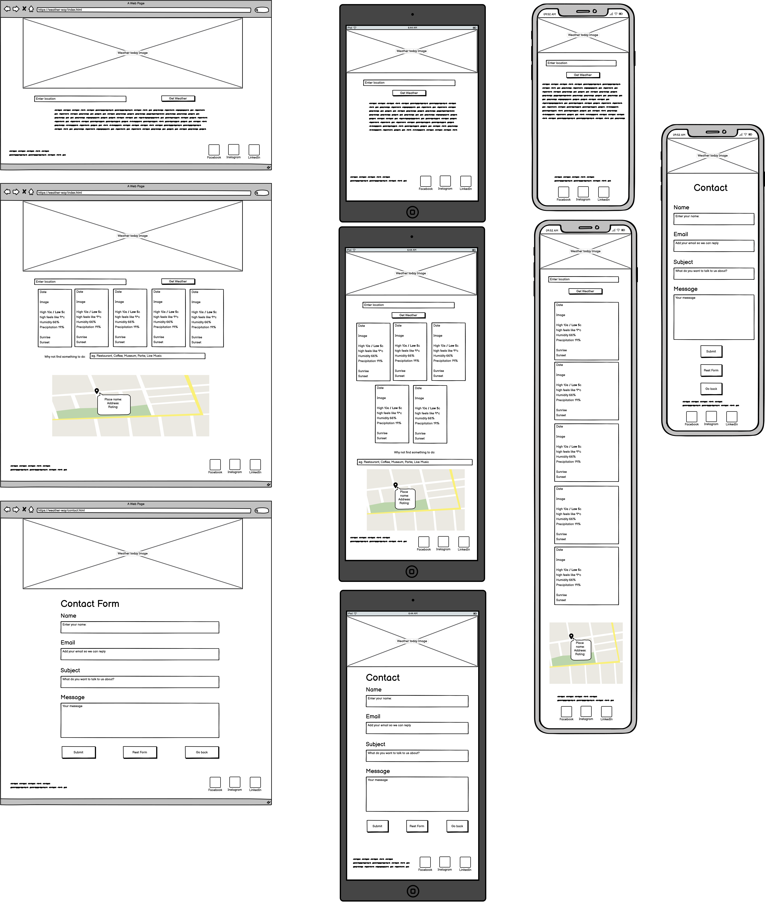
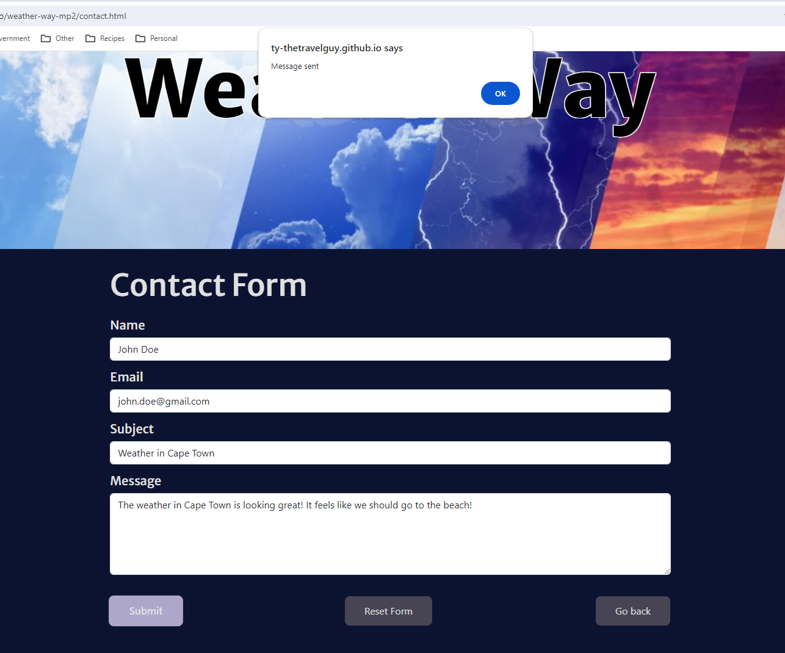

# Weather Way - Milestone Project 2

## HTML/CSS/JS ESSENTIALS - Interactive Frontend Website

Weather Way flips the script on traditional activity planning by placing the weather at the heart of your decision-making process. Here's how it works: you start by checking the weather for your desired location and date. With this information in hand, our platform then invites you to explore a diverse array of activities that perfectly align with the forecast. Whether you're keen on enjoying live music under the stars on a clear night, cozying up in a charming coffee shop during a drizzle, or wandering through the quiet halls of a museum on a rainy afternoon, Weather Way makes it effortless. Our unique approach ensures that the weather guides you towards making the best out of your day, turning what could have been a deterrent into an opportunity to discover the perfect activities for any condition.

Click [Here](https://ty-thetravelguy.github.io/weather-way-mp2/) to view the webpage.

## Table of contents

1. [Business Needs](#business-needs)

2. [User Needs](#user-needs)

3. [Design Process](#design-process)

    1. [Colours](#colours)

    2. [Wireframe](#wireframe)

    3. [Screenshots](screenshots)

4. [Technoligy used](#technology-used)

5. [Bugs](#bugs)

6. [Testing](#testing)

7. [Deployment](#deployment)

8. [Credits](#credits)

## Business Needs

1. Attract and Retain Users: Establish a platform that becomes the go-to resource for weather-related planning, thereby increasing user engagement and loyalty.
2. Brand Recognition and Trust: Build a reputable brand that is synonymous with reliability and innovation in weather-dependent planning, encouraging word-of-mouth promotion and user growth.
3. User Feedback and Improvement: Implement mechanisms for user feedback to continuously improve the platform, ensuring it meets evolving user needs and stays ahead of competition.

### Future Development Business Wants

1. Data Collection and Analysis: Gather data on user preferences and behaviour to refine and personalise the service offering, enhancing user satisfaction and the platform's value proposition.
2. Monetisation Strategies: Develop revenue models through advertising, partnerships with local businesses (like cafes, museums, and music venues), and premium subscription options offering additional features.

## User Needs

1. Accurate, Real-time Weather Forecasts: Access to reliable and precise weather information that helps them make informed decisions about planning activities.
2. Variety of Activities: The ability to search for a variety of activities that cater to different interests, weather conditions, and times of the day, ensuring there's always something to do.
3. Ease of Use: A user-friendly interface that makes it simple to navigate between weather forecasts and activity suggestions, providing a seamless planning experience.

### Future Development User Wants

1. Personalisation: The ability to receive recommendations based on personal preferences, previous searches, and location, making the planning process quicker and more relevant.
2. Social Sharing and Collaboration: Features that enable users to share plans and activity suggestions with friends and family, facilitating social outings and collaborative planning.

## Design Process

In designing the weather app, the primary goal was to create an interface that was not only functional but also visually engaging and intuitive for users. The decision to use specific colour palettes for both the website and the weather cards was driven by the desire to enhance user experience and convey information through colour effectively.

The website itself employs a sophisticated and modern colour scheme with shades of dark blue (#0C1330), muted purple (#474554), soft lavender (#ACA7CB), and light grey (#E0E0E0). This palette was chosen to create a calming and professional backdrop that allows the vibrant weather cards to stand out, ensuring users can quickly gauge the weather outlook without being overwhelmed by the interface's base colours.

For the weather cards, the use of gradients serves a dual purpose: aesthetically pleasing transitions and a visual representation of weather conditions. The gradients ranging from sunny, cloudy, snowy, rainy, foggy, to stormy weather conditions utilise specific colour schemes to evoke the essence of each weather type, making the app not just visually appealing but also highly informative at a glance.

Originally, I envisioned the app with three buttons for varying forecast lengths. However, upon reflection, I decided against this feature, concluding that a 5-day forecast sufficiently addresses user needs without complicating the interface.

The integration of the Google Places API with autocomplete functionality significantly enhances the user experience by ensuring the accuracy of city entries. This feature, coupled with the app's ability to fetch international weather data from the OpenWeather API using latitude and longitude coordinates, allows for a globally comprehensive weather service. Users can search for activities based on the weather, making the app a versatile tool for daily planning.

Additionally, a "Contact Us" form was implemented, leveraging the EmailJS API, to allow users to send emails directly through the app. This feature fosters a direct line of communication between the user and the app developer, enhancing support and user engagement.

In summary, the design process of the weather app was deeply influenced by the desire to create a user-centric interface. The thoughtful selection of color schemes, the integration of essential APIs for accuracy and global weather data, and the inclusion of a contact mechanism, all contribute to a comprehensive and intuitive user experience. The app not only serves as a tool for checking the weather but also as a guide for planning activities, reflecting a seamless blend of aesthetic appeal and functionality.

### Colours

#### Website Colours

Colours - #0C1330, #474554, #ACA7CB, #E0E0E0

#### Weather Cards

Sunny - #00CAF2, #00A1C7, #00799E

Cloudy - #FF9C12, #FFA257, #FFAE8B

Snowy - #8ED2EB, #61A6BE, #337C92

Rainy - #00457C, #3A67A2, #638AC9

Foggy - #11AC8D, #61C38B, #99D98A

Stormy - #6E6590, #8A80AD, #A89DCB

### Wireframe

### Screenshots

## Technology Used

I created my Wireframe using Balsamiq Wireframes, which was downloaded onto my computer.

HTML5 / CSS3 / JavaScript

[Bootstrap V5](https://getbootstrap.com/) for responsive design.

[W3Schools](https://my-learning.w3schools.com/) to look up syntax and when I was trying to figure out how to create some JavaScript.

[Mmdn](https://developer.mozilla.org/en-US/) to help with understanding and learning JavaScript functions.

[Chat GPT](https://chat.openai.com/) to help with debugging and learning about some of the code I used.

[Google Fonts](https://fonts.google.com/) for my fonts.

[Font Awesome](https://fontawesome.com/) for my icons on my footer.

[My Color Space](https://mycolor.space/) to look for colours which worked together.

[Coolors](https://coolors.co/) to create my colour palettes.

[iStockPhotos](https://www.istockphoto.com/) where I found and paid for the image.

[Google Console](https://developers.google.com/) to learn about their APIs, create my key and restrict the key.

[Open Weather Map](https://openweathermap.org/) the API I used to get the weather data.

[Email JS](https://www.emailjs.com/) for the contact form to set up the emailing servcie.

[Favicon.io](https://favicon.io/) to create my Favicon.

[Techsini](https://techsini.com/multi-mockup/index.php) to create my mock up.

## Bugs

While developing my app, I encountered a spacing issue after the paragraph with the ID welcomeMessage. Initially, I tried toggling visibility with visibility: hidden/visible to manage the paragraph's display. However, the containing div remained visible. Uncertain how to proceed, I asked Chat GPT about this and learned about evaluating content truthiness post-trimming, given that an empty string evaluates as falsy. This insight led me to switch to style.display = 'none' to effectively show and hide content, resolving the spacing issue seamlessly.

Integrating the Google Places Autocomplete API presented its own set of challenges. Missteps with the script URL and an overwhelming amount of data returned were initial hurdles. The turning point came when I specified the types object as cities, refining the API's output to align with my needs for city names only.

Displaying the Google Map introduced another hurdle. In my CSS I mistakenly used .map (class selector) instead of #map (ID selector), which impeded the JavaScript from locating the map ID. This oversight was corrected with help from student tutoring, reinforcing the distinction between IDs for unique elements and classes for groups sharing styles or functions.

Working with the Open Weather Map API was particularly daunting. Despite my confidence in the constructed URL, data retrieval remained elusive until I secured a student developer account and accessed a different URL. This breakthrough significantly advanced my project.

Enhancing the presentation of weather data also posed a challenge. The initial display of temperature and precipitation was overly precise. Implementing the Math.round() method refined the presentation, making it more user-friendly.

Throughout the development process, console.log was invaluable for debugging and experimentation, substantially deepening my JavaScript proficiency. ChatGPT played a crucial role, offering guidance and bolstering my problem-solving capabilities.

During testing and code validation with JSLint, the tool suggested wrapping "response" in parentheses for the fetchWeather function, which notably enhanced the app's mobile compatibility—a previously know unresolved issue when testing the weather app on a mobile. This correction seemed to marked a significant improvement in the app's functionality across mobile devices.

Another notable issue I picked up during testing involved the premature execution of showActivityBtn() following an invalid location search. Refactoring the code to conditionally execute showActivityBtn() and displayForecast() based on data validity effectively resolved this issue, ensuring a smoother user experience. See testing for more information.

I had a similar issue after the user searched for weather, and had the user not added an activity to the input field, clicked "Go For Activity", it tried to display something which wasn't there. I refactored the code to ensure if the input was black, that an alert popup would appear. In this modification, I've added a .trim() method call to the userInput value to remove any leading or trailing whitespace and a check if (userInput === '') was used to determine if the input field is empty.

## Testing

I ran the website through [W3C Markup Validation Service](https://validator.w3.org/). No errors were found.

I ran the website through [W3C CSS Validation Service](https://jigsaw.w3.org/css-validator/). There are errors from Bootstrap, and warnings about the transform used in my css.

After running my JavaScript code through [JSLint](https://www.jslint.com/) I asked Chat GPT about the warnings, and I learned quite a bit about coding standards. JSLint has a preference for lines not exceeding 80 characters, but my setup in Visual Studio Code is tailored to 120 characters, which I prefer. It also emerged that JSLint has a penchant for double quotes over single quotes, yet I've opted to stick with single quotes for my JavaScript. Furthermore, while JSLint shows a preference for traditional function declarations over arrow functions for complex operations, I judged my functions to be straightforward enough not to warrant this adjustment. I made corrections for several spacing warnings identified by JSLint and also enclosed a specific piece of code in parentheses following its recommendation. See bugs to read more on mobile device bug which was solived after running my code through JSLint.

I conducted extensive cross-browser testing, meticulously reviewing the website in various browsers. During this process, I systematically clicked on every link and button on each page to verify their functionality and ensure a consistent, error-free user experience across different platforms.

1. Google Chrome
2. Microsoft Edge
3. Opera
4. Mozilla Firefox
5. DuckDuckGo

I did notice a few styling issues on smaller screen resolutions which I corrected. Nothing which would have caused an issue, more just for visual appearance.

Additionally, I conducted tests directly on my mobile device, during which I discovered that the Google Places API was not functioning on mobile platforms. Please refer to the bugs section for more information.

I also ran each page through [Lighthouse via Microsoft Edge](https://learn.microsoft.com/en-us/microsoft-edge/devtools-guide-chromium/accessibility/lighthouse) aiming to significantly elevate the overall quality of the website. This comprehensive analysis helped identify and address key aspects of performance, accessibility, best practices, and SEO to enhance the site's effectiveness and user experience. I ran this for both desktop and mobile.

### Desktop

#### Desktop Home Page

#### Desktop Contact Page

### Mobile

#### Mobile Home Page

#### Mobile Contact Page

### Testing Documentation for script.js

#### Testing Scenario: Missing Location Input

- **Question:** What happens if the user doesn't enter a location in the required field and clicks "Go For Weather"?
- **Result:** A popup alert is displayed with the message, “Please input a city name to view its weather forecast.” After acknowledging the alert, no changes occur on the page. This feature is functioning correctly.

#### Testing Scenario: Incorrect City Name

- **Question:** What occurs if a user inputs a misspelled city name or a location that isn’t recognised as a city without selecting from the Google Places API suggestions?
- **Result:** Upon inputting an invalid city name or a location not recognised as a city by the Google Places API, an alert is displayed with the message, "An error occurred while fetching the weather data. Please enter a valid city name. If the error persists, please contact us." Initially, this scenario inadvertently triggered the showActivityBtn() function, which was not the desired outcome. To address this, I restructured the implementation to call showActivityBtn() within the fetchWeather() function, but only under the condition of receiving valid input and data. This modification was part of a broader refactor which I asked Chat GPT for, and it included an additional .then clause in the fetch(url) promise. This clause verifies the format of the data received, ensuring that displayForecast() and showActivityBtn() functions are executed exclusively when valid data is obtained. Following these adjustments, the alert now properly signals data-fetching errors without prematurely invoking related UI changes, aligning the application's behaviour with expectations.

#### Testing Scenario: No Activity input

- **Question:** What would happen if the user didn't add an activity to the input field and clicked "Go For Activity"?
- **Result:** I discovered that during this test, the program tried to display something which wasn't there, creating a large space which didn't look great. I refactored the code to ensure the user adds an activity before clicking on "Go For Activity". See bugs for more details. Now, the program will have a popup alert to advise the user "Please type in an activity before searching. Why not try live music, or a coffee shop?"

#### Testing Scenario: Using the "Start Over" Button

- **Question:** What is the behaviour when the "Start Over" button is clicked under various conditions?
- **Result:**
  - Without initiating a weather search but the user has added their location, clicking "Start Over" clears the input field, functioning as expected.
  - After a successful weather search, clicking "Start Over" clears the input and weather information, restoring the initial state.
  - Following a successful weather search and activity search, "Start Over" resets the input field, removes weather data and Google Maps with activity markers, reverting back to the initial state.
  
The "Start Over" button works flawlessly across scenarios.

### Testing Documentation for ContactForm.js

#### Testing Scenario: Empty Form Submission

- **Question:** What happens if the user attempts to submit the form without filling it out?
- **Result:** To enhance validation, I shifted from HTML's required attributes to JavaScript-based validation. An if statement now checks for empty fields, triggering a popup alert with, "Please fill in all fields before submitting" if necessary. This validation works correctly.

#### Testing Scenario: Form Reset

- **Question:** What occurs when the user resets the form?
- **Result:** All form fields are cleared as expected.

#### Testing Scenario: Form Submission Feedback

- **Question:** What feedback does the user receive upon form submission?
- **Result:** Upon successful submission, an alert informs the user of success and clears the form. In the event of an error, an alternative alert indicates failure with the message, “Error, your message was not sent. Please try again!”. This was tested by intentionally altering the API key, prompting the error alert as expected.

#### Testing Scenario: "Go Back" Button Functionality

- **Question:** What functionality does the "Go Back" button provide?
- **Result:** The "Go Back" button navigates the user back to the main index.html page, a function also replicated by clicking on the page's image. Both methods reliably return the user to the homepage.

### Conclusion

The testing confirms that the functionalities of both script.js and ContactForm.js are now performing to specification, with no detected issues.

## Deployment

### Deploying my project

1. I went onto [GitHub](https://github.com/).
2. Navigated to my [Weather Way Repository](https://github.com/Ty-Thetravelguy/weather-way-mp2).
3. Clicked settings along the top options bar.
4. Clicked pages found on the left under "code and automation".
5. Under "Branch", I changed it from none to main, and saved.
6. Refreshed the screen and the link was provided at the top of the screen.

### Cloning my project

If you would like to work on my project further, you can clone mine or create your own which is called forking.

#### Cloning

1. Scroll to the top of my repository and click the "Code" button and choose "Clone" with HTTPS or SSH.
2. You'll get a URL which can use to clone the repository.

#### Creating your own (Forking)

1. Instead of cloning, you can directly fork my repository to create a copy under your GitHub account.
2. To do this, you simply click the "Fork" button on the top right of my repository's GitHub page.
3. This creates a copy of my repository in your account, which can then clone, modify, and work with as your own repository.

## Credits

- My mentor Spencer Barriball.
  - Spencer has been great in reminding to make notes throughout my code and put my mind at ease that my project was a good idea.

- Studient Tutoring.

- When searching for an idea for this MP2, I came across [Steve Griffith on YouTube](https://www.youtube.com/@SteveGriffith-Prof3ssorSt3v3). I must give alot of credit to him because without his video, I wouldn't understand what I know now. Some of the code I used was his, but I made sure I made it unique to my project and that I understood everything I was doing.

- Lastly, I want to express my gratitude to Ben Smith, my lecturer, for his support and motivation throughout this project. I encountered a few personal issues and began to lose confidence in my coding abilities, which I genuinely love. Ben was extremely professional and provided guidance that helped steer me back on track. Additionally, I am thankful for the extension he granted.
